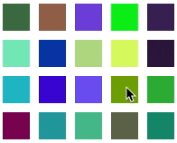
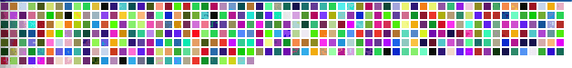
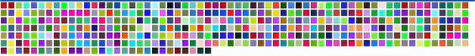
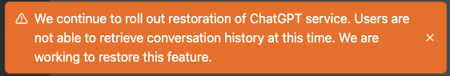
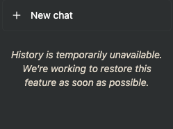
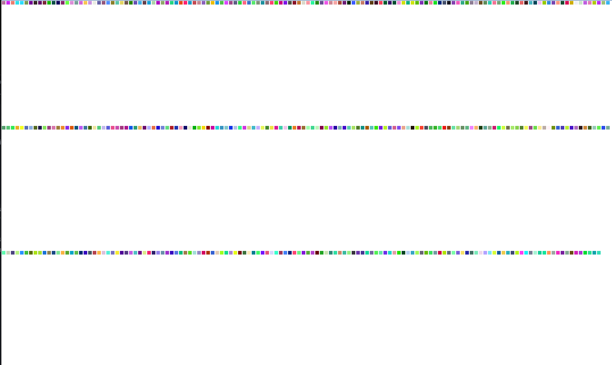
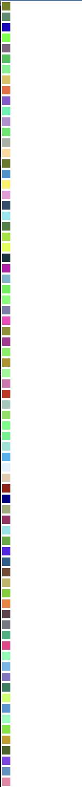
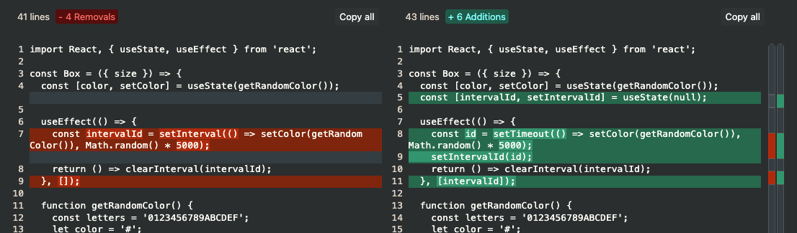

#  Party-Dots

###  ✨ Check out the [Live Site](https://intuitiveharmony.github.io/party-dots/ "Party with the Dots!")

*for best viewing: please turn off any dark mode extensions you may have in your browser*

<br />

🚧 THIS README IS A WORK IN PROGRESS 🚧

<br/>

##  GPT Co-Create-React-App

In this project I wanted to take more of a back seat role and see what OpenAI's [chatGPT](https://openai.com/blog/chatgpt) could create based solely on me inputing prompts into the chat bot describing what I was trying to put together.  I had an idea of creating a [React App](https://react.dev/) that was a page covered in squrares that changed to a random color at random time intervals. 

To be clear: most of this code was generated by chatGPT 

### What Does that Mean?

- There are many parts of this project that I would have approached differently had I coded it on my own
- There are a few lines of code in here that I don't completely understand at the moment
- There were a few times that I interviened because I either got too excited or the bot was unable to complete what I was trying to accomplish. Although I typically tried to exaust my attempts to solve it within the chat prompts rather than simply changeing the code itself. 
 
With this project the focus was more or less having fun and exploring what chatGPT was capeable of plus examine some of the interactions and challenges I had with the program.

Let's go! ⚡

<br />

##  Set Up

To begin, I initilized a react app and deleted the boilerplate code contained within the `app.js` and `app.css` files.  From there I started imputing prompts into GPT.  

Since I just "went for it" in a <kbd>prompt</kbd> => <kbd>copy</kbd> + <kbd>paste</kbd> <kbd>frenzy!!!</kbd> I wasn't following proper git flow so my initial commit is a major portion of the project completed (sorry, octocat :octocat:).  Therefore, I have included some of my prompts and the code that was produced by GPT3 in the process of co-writing Party Dots.  

><hr/>
>
>🔍 If you are curious, you can find the bulk of the [transcript](https://github.com/IntuitiveHarmony/party-dots/blob/master/chat.md) by refering to the chat.md.  There is one small part missing from this transcript; another chat I had with GPT about getting my github link into the top right corner dot.  I didn't include it in the transcript as it seemed redundant, considering the 40+ prompts that already seem to cover that same area.  Essentially I became locked in a loop which I broke by adjusting the code myself. 
>
><br/>
>
>🔬 If you are extra curious, feel free to explore the commit history of [party-dots-history](https://github.com/IntuitiveHarmony/party-dots-history), where I made another repo so I could get the neccessary screenschots for this write up. 
>
><br/>
>
>🏄 Follow Along
>
>You can also see the various stages of party-dots in development by following these steps in your terminal:
>
>1. Clone the party-dots-history repo to your local machine and `cd` in to it
>
>```
>git clone https://github.com/IntuitiveHarmony/party-dots-history.git
>cd party-dots-history
>```
>
>2. Install react library locally
>
>```
>npm i
>```
>
>3. Using the SHA keys in the chart below, pull up the version of the code you want to explore. (This is prompt 3) 
>
>```
>git checkout ef2c7ce652c224bc41a17110f78db338c137ada4
>```
>
>4. This will put git in to a `detached head state` to navigate to a later commit, you will need to run this command first
>
>```
>git checkout master
>```
>
>5. Once you are on the commit you would like to view, run
>
>```
>npm start
>```
><details>
>
><summary>Party Dots Commit History</summary>
>
>| Commit Name   | Git SHA Key                                 | Notes |
>| ------------- | ---------------------------------------- | ----- |
>| Final Edits to Code (master) | 3238df2c44773a487fdba9f7c72fcff9dd3ad286 | favicon, idex.html, title, github link |
>| prompt 41     | af56b5c8da63df85715dfbe56aff144449844eda |       |
>| prompt 40     | ac0e850640d30509df6d708a2cfc7a1f6c88aac7 |       |
>| prompt 39     | b182ae22c3feaa1108f039b746c5b3b656dcb2f3 |       |
>| prompt 38     | 8bed0279edd382e37c666ea8c1cb97a27f0133fb |       |
>| prompt 37     | 40def85d44b3439b9c517e40424d4839784f50ae |       |
>| prompt 36     | 2e1d51fb2ba2800b6e96f8bbdacd4b3867f1a5c1 |       |
>| prompt 29 - response | 689979a1b529219fd4a1281ce081eab055277ab5 |       |
>| prompt 29     | 179b70abf2a0ad7b28b329716289269d266c456b |       |
>| prompt 28     | a27561d9968a482d921364e3b1310613305c6ea5 |       |
>| prompt 27     | 072edf15c1dab176b44693360be6d3571db68fd6 |       |
>| prompt 26     | 24cc061b99964383d135ddb1c6c3890ce9a9630a |       |
>| prompt 25     | 0ece9386dc7b283c0e472b4a44a763e800e718c7 |       |
>| prompt 24     | 3fed203722cde99dd8c1285a085dd0323db389d0 |       |
>| prompt 23     | 13e9543d791a4456136d26550469d043010354c5 |       |
>| prompt 22     | efc4334128e9615b86262c38316fff8fa4fc7fe4 |       |
>| prompt 21     | 42fd3b036f8f0d0fd6fb0ec01164020fc373e5d6 |       |
>| prompt 20     | 743de1758fe1f58a41ee1dcde8c736bdb1be4529 |       |
>| prompt 19 - comments | da1bdafebec86428c69f6dc5ed583ec2a2c3195b |       |
>| prompt 19     | 8e4260a5cf3f10ff5d1e3c062805fab11acef30d |       |
>| prompt 18     | caf2509ba9f21f74e5d4ef55d8deff8b0f1a3eb6 |       |
>| prompt 17 - response | cdcf58e5cc0a947c070a8f6d0cdb13a76533f8bb |       |
>| prompt 17     | 1205ab7dfe9f88fdd02e9054ab5fa197efcc1b6e |       |
>| prompt 16 💀    | 6756a8020ed69f3847b07f0c124abb33077f962d | computers are too literal sometimes |
>| prompt 15     | 852d9798b3c367f48ba86cfd1e115d21c0d4f2f1 |       |
>| prompt 14     | 55147b2290953893fd2dfe98b4b8439657ab717c |       |
>| prompt 13     | 64648e290efecf928fd474829f88adaa6ecf1e19 |       |
>| prompt 12     | cc09a2f376c57604f4208acd8ac5c294e3add7d6 |       |
>| prompt 11     | 090d6744d5afe9e64f1e209c009be704e854bd4f |       |
>| prompt 10 - Response    | e7f1e3fd895eb9e322482c49de29db5f7df4c48f |       |
>| prompt 10 - Base    | f18b15b075c19183bc6b6a84f7a189ecf6aeeb8f |       |
>| prompt 9      | 976614a8f5df784d908247d9cdab3e91e24b69eb |       |
>| prompt 8      | 4ba6d1d0a94ecca218e2acbf0811b3d7120cb13b | individual divs take up entire screen |
>| prompt 7      | 0873b9c8247ebd47572bad6287f7cda04ed1355f |       |
>| prompt 6 with error coment     | a7e5ca2bb952e318e82d8d87f6f08301f99b5e9c |       |
>| prompt 6      | 4ae840346862eb3ad7a7f6d845b26158f5f0b19b |       |
>| add chat.md   | f9ac3b0f10e538c85c64079f4d401328403f8e72 |       |
>| prompt 5      | 35bc93744af725c51cac640db357ab38cc6456d4 |       |
>| prompt 4      | 25b5b0935a122c2e98bd1d3bf431d633ba7eb99e |       |
>| prompt 3      | ef2c7ce652c224bc41a17110f78db338c137ada4 |       |
>| prompt 2 - comments     | 9b74ebe8d28bca15210b4cbd2c4a76b0b34ebe49 |       |
>| prompt 1 - comments     | 0681ba0da97d2cedf1a27729d617f4fd9049e49c |       |
>
></details>
>
><hr/>

<br />

##  The Prompts Begin

While I am very polite I real life and with humans, I chose to be as direct as I could as to not give the bot exteranerous information while asking it to complete a task.  I would however express gratitude and let the program know when the desired code was achieved.

<br />

### *prompt 1*
> GPT - Hello! How may I assist you today?<br /><br/>ME - make a react app page that has small divs that individually change color randomly<br /><br/>GPT - Sure! Here's an example of a React component that generates small divs with random colors:

<details>

<summary>Show/ Hide Code</summary>

```javascript
import React, { useState } from 'react';

const Box = ({ size }) => {
  const [color, setColor] = useState(getRandomColor());

  function handleClick() {
    setColor(getRandomColor());
  }

  function getRandomColor() {
    const letters = '0123456789ABCDEF';
    let color = '#';
    for (let i = 0; i < 6; i++) {
      color += letters[Math.floor(Math.random() * 16)];
    }
    return color;
  }

  return (
    <div
      onClick={handleClick}
      style={{
        backgroundColor: color,
        width: `${size}px`,
        height: `${size}px`,
        margin: '5px',
      }}
    />
  );
};

const BoxContainer = ({ numBoxes, boxSize }) => {
  const boxes = Array.from({ length: numBoxes }).map((_, i) => (
    <Box key={i} size={boxSize} />
  ));
  return <div style={{ display: 'flex', flexWrap: 'wrap' }}>{boxes}</div>;
};

export default function App() {
  return <BoxContainer numBoxes={50} boxSize={30} />;
}
```
</details>

<br />

Once I ran the code that it gave me I ended up with a large handful of randomly colored squares that would change to random colors once they were clicked. Not quite what I was going for but hey, Rome wasn't built in a day either.

It also gave me an explination of the code it provided, which I didn't read, beacuse, as I stated earlier, I was trapped in a 🌪️ of <kbd>prompt</kbd> => <kbd>copy</kbd> + <kbd>pasting</kbd>   

I did however, include them in the code as comments if you are interested in reading what chatGPT had to say about its own code.



<br />

### *prompt 2*
> ME - Can you make it so the page is covered with boxes and they change colors on their own rather than a click<br/><br/>GPT - Sure! Here's an updated version of the component that generates boxes that automatically change colors:

<details>

<summary>Show/ Hide Code</summary>

```javascript
import React, { useState, useEffect } from 'react';

const Box = ({ size }) => {
  const [color, setColor] = useState(getRandomColor());

  useEffect(() => {
    const interval = setInterval(() => {
      setColor(getRandomColor());
    }, 1000);
    return () => clearInterval(interval);
  }, []);

  function getRandomColor() {
    const letters = '0123456789ABCDEF';
    let color = '#';
    for (let i = 0; i < 6; i++) {
      color += letters[Math.floor(Math.random() * 16)];
    }
    return color;
  }

  return (
    <div
      style={{
        backgroundColor: color,
        width: `${size}px`,
        height: `${size}px`,
        margin: '1px',
      }}
    />
  );
};

const BoxContainer = ({ numBoxes, boxSize }) => {
  const boxes = Array.from({ length: numBoxes }).map((_, i) => (
    <Box key={i} size={boxSize} />
  ));
  return <div style={{ display: 'flex', flexWrap: 'wrap' }}>{boxes}</div>;
};

export default function App() {
  return <BoxContainer numBoxes={400} boxSize={8} />;
}
```

</details>

<br/>

I had a couple of issues with this output:

- All of the squares were at the top of the page.
- All of the squares were changing colors at the same time

I knew that we needed to address these problems one at a time 🔧


 
<br/>

### *prompt 3*
> ME - Can you make it so the boxes change at random time intervals rather than at all the same time<br/><br/>GPT - Sure! Here's an updated version of the component that generates boxes that change colors at random intervals:

<details>

<summary>Show/ Hide Code</summary>

```javascript
import React, { useState, useEffect } from 'react';

const Box = ({ size }) => {
  const [color, setColor] = useState(getRandomColor());
  const [intervalId, setIntervalId] = useState(null);

  useEffect(() => {
    const id = setTimeout(() => setColor(getRandomColor()), Math.random() * 5000);
    setIntervalId(id);
    return () => clearInterval(intervalId);
  }, [intervalId]);

  function getRandomColor() {
    const letters = '0123456789ABCDEF';
    let color = '#';
    for (let i = 0; i < 6; i++) {
      color += letters[Math.floor(Math.random() * 16)];
    }
    return color;
  }

  return (
    <div
      style={{
        backgroundColor: color,
        width: `${size}px`,
        height: `${size}px`,
        margin: '1px',
      }}
    />
  );
};

const BoxContainer = ({ numBoxes, boxSize }) => {
  const boxes = Array.from({ length: numBoxes }).map((_, i) => (
    <Box key={i} size={boxSize} />
  ));
  return <div style={{ display: 'flex', flexWrap: 'wrap' }}>{boxes}</div>;
};

export default function App() {
  return <BoxContainer numBoxes={400} boxSize={8} />;
}
```

</details>

<br/>

The Intervals were happening closer to what I had originaly invisioned.  Let's work on the squares taking up the whole page now.



*NOTE: some of these GIFs have a poor quality and do not reflect the actual page content acurately<br>If anyone can show me how to make a high quality GIFs send me a message* 😎

<br/>

##  Interuption

When I went to work on this markdown today I was meet with this message:

<br/>



This brings up a point on using this or any 3rd party technology that we may as well talk about now. The user may place varying levels of dependency on the tools they use.  When these tools breakdown or are tempararally unavailable it can create a real issue for their own productivity.  Since all of the chat history is currently unavailable I am unable to go back through to get the versions of the code I went through with GPT.  There is also the possibility that those chat histories are gone foever (it has happened before 😭)

### A few days later...

I went to check to see if my chat history was avalable and I was meet with a different message. 

<br/>



Luckily, this was just party dots (as awesome as it is) and not a more important project.  If it were a more urgent that I needed the information from that chat history I would basicly need to try and recreate the prompts and just see what I got back.

<br/>

##  Back In Business

### *prompt 4*

>ME - thanks, that looks great! although the boxes are confined to a tight strip at the top of the page. can you make them take u[ the entire page?<br/><br/>GPT - Yes, you can modify the CSS styles of the BoxContainer component to make it take up the entire page. Here's an updated version of the code:

<details>

<summary>Show/ Hide Code</summary>

```javascript
import React, { useState, useEffect } from 'react';

const Box = ({ size }) => {
  const [color, setColor] = useState(getRandomColor());
  const [intervalId, setIntervalId] = useState(null);

  useEffect(() => {
    const id = setTimeout(() => setColor(getRandomColor()), Math.random() * 5000);
    setIntervalId(id);
    return () => clearInterval(intervalId);
  }, [intervalId]);

  function getRandomColor() {
    const letters = '0123456789ABCDEF';
    let color = '#';
    for (let i = 0; i < 6; i++) {
      color += letters[Math.floor(Math.random() * 16)];
    }
    return color;
  }

  return (
    <div
      style={{
        backgroundColor: color,
        width: `${size}px`,
        height: `${size}px`,
        margin: '1px',
      }}
    />
  );
};

const BoxContainer = ({ numBoxes, boxSize }) => {
  const boxes = Array.from({ length: numBoxes }).map((_, i) => (
    <Box key={i} size={boxSize} />
  ));
  return (
    <div
      style={{
        display: 'flex',
        flexWrap: 'wrap',
        width: '100vw',
        height: '100vh',
        overflow: 'hidden',
      }}
    >
      {boxes}
    </div>
  );
};

export default function App() {
  return <BoxContainer numBoxes={400} boxSize={8} />;
}
```

</details>

<br/>



*note: in the actual app the div were randomly changing color on their own*

<br/>

### *prompt 5*

>ME - now it is in three seperate strips<br/><br/>GPT - I see, that's likely due to the default flex-direction value of row on the display: flex property of the container<br/><br/>GPT - To make the boxes fill up the entire page without any gaps, you can set the flex-direction to column, and adjust the width and height values of the BoxContainer accordingly. Here's an updated version of the code:

<details>

<summary>Show/ Hide Code</summary>

```javascript
import React, { useState, useEffect } from 'react';

const Box = ({ size }) => {
  const [color, setColor] = useState(getRandomColor());
  const [intervalId, setIntervalId] = useState(null);

  useEffect(() => {
    const id = setTimeout(() => setColor(getRandomColor()), Math.random() * 5000);
    setIntervalId(id);
    return () => clearInterval(intervalId);
  }, [intervalId]);

  function getRandomColor() {
    const letters = '0123456789ABCDEF';
    let color = '#';
    for (let i = 0; i < 6; i++) {
      color += letters[Math.floor(Math.random() * 16)];
    }
    return color;
  }

  return (
    <div
      style={{
        backgroundColor: color,
        width: `${size}px`,
        height: `${size}px`,
        margin: '1px',
      }}
    />
  );
};

const BoxContainer = ({ numBoxes, boxSize }) => {
  const boxes = Array.from({ length: numBoxes }).map((_, i) => (
    <Box key={i} size={boxSize} />
  ));
  return (
    <div
      style={{
        display: 'flex',
        flexWrap: 'wrap',
        flexDirection: 'column',
        width: '100%',
        height: '100%',
        overflow: 'hidden',
      }}
    >
      {boxes}
    </div>
  );
};

export default function App() {
  return <BoxContainer numBoxes={400} boxSize={8} />;
}
```

</details>

This version made the boxes in on column all the way over to the left.



## 😑

<br/>

##  Let's Back Up a Minute

It seemed like we started getting farther from where I wanted to go so I brought it back to the code from the third prompt.  This felt like it was the closest so far to the direction I wanted to go. This is what it looked like:


<br/>

### *prompt 6*

>ME - go back to this code :<br/><br/>
>```javascript
>import React, { useState, useEffect } from 'react';
>
>const Box = ({ size }) => {
>  const [color, setColor] = useState(getRandomColor());
>  const [intervalId, setIntervalId] = useState(null);
>
>  useEffect(() => {
>    const id = setTimeout(() => setColor(getRandomColor()), Math.random() * 5000);
>    setIntervalId(id);
>    return () => clearInterval(intervalId);
>  }, [intervalId]);
>
>  function getRandomColor() {
>    const letters = '0123456789ABCDEF';
>    let color = '#';
>    for (let i = 0; i < 6; i++) {
>      color += letters[Math.floor(Math.random() * 16)];
>    }
>    return color;
>  }
>
>  return (
>    <div
>      style={{
>        backgroundColor: color,
>        width: `${size}px`,
>        height: `${size}px`,
>        margin: '1px',
>      }}
>    />
>  );
>};
>
>const BoxContainer = ({ numBoxes, boxSize }) => {
>  const boxes = Array.from({ length: numBoxes }).map((_, i) => (
>    <Box key={i} size={boxSize} />
>  ));
>  return <div style={{ display: 'flex', flexWrap: 'wrap' }}>{boxes}</div>;
>};
>
>export default function App() {
>  return <BoxContainer numBoxes={400} boxSize={8} />;
>}
>```
><br/>GPT - Sure, what changes would you like me to make?

<br/>

<hr/>

##  Replacing One Error With Another, or The Loops Begin

Prompts 7 - 9 show us that chatGPT can help us solve errors within our code but that it is fallible as well.  In prompt 7 I input an error that was being thrown in when the code from the previous promt was ran.  I pasted the error in to the chat bot, to see if it was able to generate code that would avoid the `Maximum update depth exceeded.` I knew it was caused due to `intervalId` being inside the dependency array in the `useEffect` hook.  Don't worry, chat figured it out too.

<br/>

### *prompt 7*

>ME - it keeps throwing this error:<br/>
>```
>Warning: Maximum update depth exceeded. This can happen when a component calls setState inside useEffect, but useEffect either doesn't have a dependency array, or one of the dependencies changes on every render. at Box (http://localhost:3000/static/js/bundle.js:28:5) at div at BoxContainer (http://localhost:3000/static/js/bundle.js:62:5) at App
>```
>GPT - This error occurs when the component gets stuck in an infinite loop of rendering, and it's usually caused by a state update that triggers a re-render, which then triggers another state update, and so on. In your case, it looks like the useEffect hook inside the Box component is causing the issue.<br/><br/>GPT - To fix this, you need to pass an empty dependency array ([]) to the useEffect hook, so that it only runs once when the component mounts, instead of running on every re-render.<br/><br/>GPT - Here's the updated code:

<details>

<summary>Show/ Hide Code</summary>

```javascript
import React, { useState, useEffect } from 'react';

const Box = ({ size }) => {
  const [color, setColor] = useState(getRandomColor());

  useEffect(() => {
    const intervalId = setInterval(() => setColor(getRandomColor()), Math.random() * 5000);
    return () => clearInterval(intervalId);
  }, []);

  function getRandomColor() {
    const letters = '0123456789ABCDEF';
    let color = '#';
    for (let i = 0; i < 6; i++) {
      color += letters[Math.floor(Math.random() * 16)];
    }
    return color;
  }

  return (
    <div
      style={{
        backgroundColor: color,
        width: `${size}px`,
        height: `${size}px`,
        margin: '1px',
      }}
    />
  );
};

const BoxContainer = ({ numBoxes, boxSize }) => {
  const boxes = Array.from({ length: numBoxes }).map((_, i) => (
    <Box key={i} size={boxSize} />
  ));
  return <div style={{ display: 'flex', flexWrap: 'wrap' }}>{boxes}</div>;
};

export default function App() {
  return <BoxContainer numBoxes={400} boxSize={8} />;
}
```

</details>

<br/>

Take a look at the code if you want to, chat GPT was able to fix the dependency array issue.  The part I really want to talk about is what came next.  

I felt like that we were at a point in the code that I would like to come back to so I thought chatGPT would be able to reference it's own chat history with me and girve me some sort of version control capability.  I was proven wrong two prompts later.

<br/>

### *prompt 8*

>ME - ok lets refer to this code as base because we are going to change stuff.<br/><br/>ME - The boxes are taking up a small strip at the top. none of the previous fixes worked. What can we do to make the boxes take up all the space on the screen?<br/><br/>GPT - To make the boxes take up all the space on the screen, you can set the height of the BoxContainer to be 100vh (which means 100% of the viewport height), and set the width of the BoxContainer and Box components to be 100%.<br/><br/>GPT - Here's an updated version of the code:

<details>

<summary>Show/ Hide Code</summary>

```javascript
import React, { useState, useEffect } from 'react';

const Box = ({ size }) => {
  const [color, setColor] = useState(getRandomColor());

  useEffect(() => {
    const intervalId = setInterval(() => setColor(getRandomColor()), Math.random() * 5000);
    return () => clearInterval(intervalId);
  }, []);

  function getRandomColor() {
    const letters = '0123456789ABCDEF';
    let color = '#';
    for (let i = 0; i < 6; i++) {
      color += letters[Math.floor(Math.random() * 16)];
    }
    return color;
  }

  return (
    <div
      style={{
        backgroundColor: color,
        width: `${size}px`,
        height: `${size}px`,
        margin: '1px',
      }}
    />
  );
};

const BoxContainer = ({ numBoxes, boxSize }) => {
  const boxes = Array.from({ length: numBoxes }).map((_, i) => (
    <Box key={i} size={boxSize} />
  ));
  return <div style={{ display: 'flex', flexWrap: 'wrap' }}>{boxes}</div>;
};

export default function App() {
  return <BoxContainer numBoxes={400} boxSize={8} />;
}
```

</details>

<br/>

This code gave us individual divs that took up the whole screen.  Another step in the wrong direction, but a great opprotunity for me to go back to the `base` code, right?

<br/>

### *prompt 9*

>ME - that didn't work go back to the base please<br/><br/>GPT - Sure, here is the original base code for reference:

<br/>

<details>

<summary>Show/ Hide Code</summary>

```javascript
import React, { useState, useEffect } from 'react';

const Box = ({ size }) => {
  const [color, setColor] = useState(getRandomColor());
  const [intervalId, setIntervalId] = useState(null);

  useEffect(() => {
    const id = setTimeout(() => setColor(getRandomColor()), Math.random() * 5000);
    setIntervalId(id);
    return () => clearInterval(intervalId);
  }, [intervalId]);

  function getRandomColor() {
    const letters = '0123456789ABCDEF';
    let color = '#';
    for (let i = 0; i < 6; i++) {
      color += letters[Math.floor(Math.random() * 16)];
    }
    return color;
  }

  return (
    <div
      style={{
        backgroundColor: color,
        width: `${size}px`,
        height: `${size}px`,
        margin: '1px',
      }}
    />
  );
};

const BoxContainer = ({ numBoxes, boxSize }) => {
  const boxes = Array.from({ length: numBoxes }).map((_, i) => (
    <Box key={i} size={boxSize} />
  ));
  return <div style={{ display: 'flex', flexWrap: 'wrap' }}>{boxes}</div>;
};

export default function App() {
  return <BoxContainer numBoxes={400} boxSize={8} />;
}
```

</details>

<br/>

If we take the code from prompt 7 and compare it to promt 9 using a [diff checker](https://www.diffchecker.com/compare/), we see that there are some differences. 



<br/>

Wait, what was that? 

Did I just see somethng in the dependency array?  The code was supposed to be free of that, this is the code from prompt 6, not the base!  I feel like the premise for a modern day three stooges episode is cooking underneath all of this. 🎭
